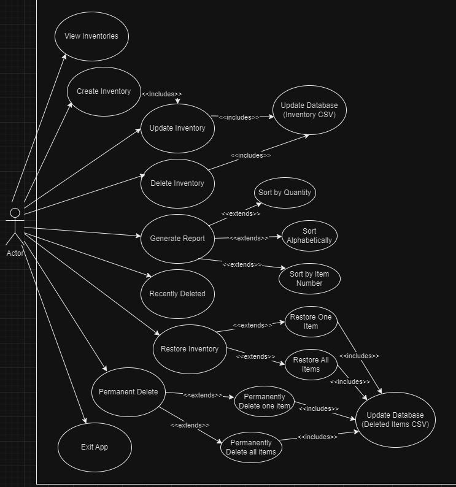
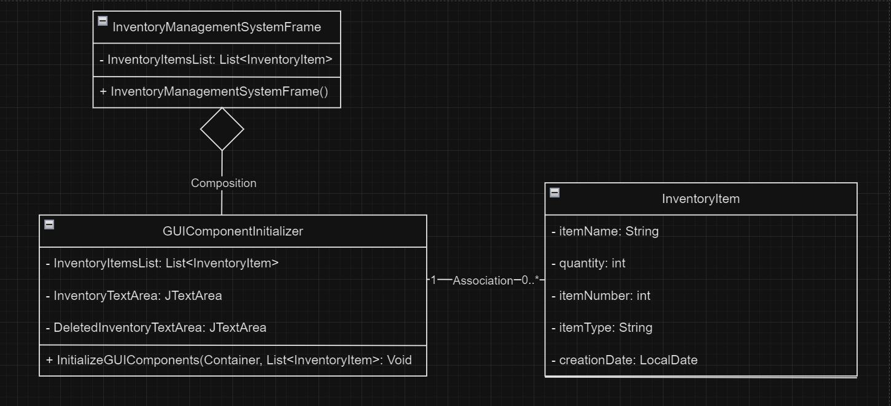
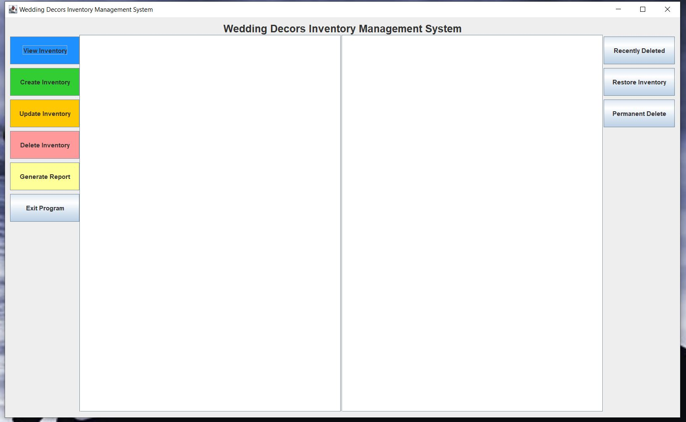

# Wedding Decors Inventory Management System

### Table of Contents

1. [Overview](#overview)
2. [Features](#features)
3. [Advanced Functionality](#advanced-functionality)
4. [Usage](#usage)
5. [UML Diagram](#uml-diagram)
6. [Class Diagram](#class-diagram)
7. [Getting Started](#getting-started)
8. [Developed Using](#developed-using)
9. [Feedback](#feedback)

### Overview

Welcome to our Wedding Decor Inventory Management System! This application is designed to streamline the process of managing inventory for wedding planners and decorators. With features tailored to the unique needs of wedding professionals, our system offers a comprehensive solution for organizing, tracking, and reporting on wedding decor items.

With a focus on simplicity and functionality, our system facilitates the smooth handling of inventory tasks, allowing users to effortlessly input new items, track existing ones, and make necessary modifications as needed. From elegant vases to exquisite table runners and lush greenery, our system accommodates a variety of decor types to suit every wedding theme and style.

### Features

Our Wedding Decor Inventory Management System offers a seamless experience with its intuitive interface, enabling users of all technical backgrounds to effortlessly navigate through features like viewing, creating, and updating inventory items. Easily add, modify, or delete items to maintain an accurate inventory, with the option to permanently delete or restore items as needed. Confirmation prompts add an extra layer of security, while detailed CSV reports provide insights into inventory data, supported by persistent storage for seamless continuity across sessions.

`User-Friendly Interface`: With an intuitive and user-friendly interface, our system is easy to navigate and use, even for users with minimal technical expertise.

`View Inventory`: Quickly access an overview of your inventory, categorized by item type, to see what items are available and their quantities.

`Create Inventory`: Easily add new decor items to your inventory, specifying details such as name, quantity, and type (e.g., greenery, vases, table runners).

`Update Inventory`: Modify existing inventory items by updating their details such as quantity, item name, or type. This feature ensures that your inventory remains accurate and up-to-date.

`Delete Inventory Items`: Remove unwanted or outdated inventory items from your database with ease. This feature helps declutter your inventory and maintain its relevance.

`Permanently Delete`: In addition to the ability to delete inventory items, our system offers the option to permanently delete items from the database. This feature ensures that deleted items are completely removed from the system, freeing up space and optimizing database performance.

`Restore Deleted Items`: Accidentally deleted an item? No problem! Our system allows you to restore deleted items, ensuring that no valuable data is lost.

`Confirmation Prompts`: Reduce the risk of accidental actions with confirmation prompts for critical operations such as generating reports or deleting items. This helps prevent unintended data loss or errors.

`Generate Reports`: Generate detailed reports of your overall inventory in CSV format, making it easy to analyze and share inventory data. After generating a report, user can sort items alphabetically, by quantity, or by item number. This feature provides flexibility in organizing and analyzing your inventory data.

`Persistent Data Storage`: Inventory data is saved in a CSV file, ensuring that your data persists between application sessions.

### Advanced Functionality

In addition to the core features, our Wedding Decor Inventory Management System also offers advanced functionality to meet the diverse needs of wedding professionals:

`Random Item Number Generation`: Automatically generate unique item numbers based on item type, ensuring that each item in your inventory has a distinct identifier.

`CSV File Handling`: Seamlessly import and export inventory data using CSV files. This feature enables easy integration with other tools and systems, enhancing interoperability.

`Startup Data Loading`: Automatically load existing inventory data from CSV files during application startup, saving time and ensuring continuity between sessions.

`Error Handling`: Robust error handling mechanisms ensure that any unexpected issues are handled gracefully, minimizing disruptions to your workflow and data integrity. This includes `input trimming` to remove leading and trailing whitespace, as well as `input sanitization` to filter out potentially harmful characters, thus ensuring clean and safe data processing.

### Usage

`Creating Inventory Items`: Use the "Create Inventory" option to add new decor items to your inventory. Provide details such as the item name, quantity, and select the appropriate item type(s).

`Viewing Inventory`: Select the "View Inventory" option to see a categorized list of your inventory items. Items are grouped by type for easy reference.

`Generating Reports`: Choose the "Generate Report" option to create a detailed report of your inventory in CSV format. This report includes information such as item type, name, and quantity.

`Exiting the Application`: When you're finished using the application, select the "Exit App" option to close the program. Inventory data is automatically saved for future use.

### UML Diagram

    

##### Use case descriptions list:

1. **User** can `view` all the items in the inventory.
2. **User** can `create` inventory items. This includes the ability to update an item in the inventory. This automatically includes updating the inventory database (Inventory CSV)
3. **User** can `update` an inventory item that have already been created. This automatically includes updating the inventory database (Inventory CSV).
4. **User** can `delete` an inventory item that have already been created or edited. This automatically includes updating the inventory database (Inventory CSV).
5. **User** can `generate` a report consisting of all the items in the inventory. Once the report is generated, user can also sort the report alphabetically, by item number or quantity.
6. **User** can `view recently deleted` items from the deleted items CSV.
7. **User** can `restore` a deleted items from the database (Deleted Items CSV). During restoration, user can restore one item from the deleted list or all items.
8. **User** can `premanently delete` a deleted items from the database (Deleted Items CSV). During deletion, user can permanently delete one item from the deleted list or all items.
9. **User** can `exit` the application.

### Class Diagram

    

##### Overview of Class Diagram:

- `Inventory Management System Frame`: Represents the main frame of the inventory management system. It has an association relationship with GUI Component Initializer, indicating that the frame utilizes the GUI component initializer to set up its graphical components. Additionally, it has a composition relationship with Inventory Item, indicating that the frame contains a list of inventory items.

- `GUI Component Initializer`: Responsible for initializing GUI components. It also has an association relationship with Inventory Item.

- `Inventory Item`: Represents an item in the inventory. It has attributes and methods to manage item details.

##### Written Descriptions:

1. Inventory Management System Frame <-> GUI Component Initializer:

   - `Description`: The Inventory Management System Frame class collaborates with the GUI Component Initializer class to initialize GUI components within the main frame of the inventory management system.
   - `Reverse Description`: The GUI Component Initializer class interacts with the Inventory Management System Frame class to initialize GUI components within the main frame of the inventory management system.

2. GUI Component Initializer <-> Inventory Item:

   - `Description`: The GUI Component Initializer class requires access to Inventory Item objects to initialize certain GUI components, such as creating, deleting, updating, and viewing an item.
   - `Reverse Description`: The Inventory Item class provides data to the GUI Component Initializer class for initializing GUI components, such as creating, deleting, updating, and viewing an item.

3. Inventory Management System Frame <-> Inventory Item:
   - `Description`: The Inventory Management System Frame class maintains a list of Inventory Item objects to manage the inventory data within the system.
   - `Reverse Description`: Inventory Item objects are stored within the Inventory Management System Frame class to represent inventory items and manage the inventory data within the system.

##### Classes Relationship:

- The classes Inventory Management System Frame and GUI Component Initializer have a dependency relationship. This means that Inventory Management System Frame relies on GUI Component Initializer to initialize GUI components within the main frame of the inventory management system. The Inventory Management System Frame class uses the methods provided by GUI Component Initializer to set up the graphical user interface.

- Additionally, there is an association relationship between Inventory Management System Frame and Inventory Item. This indicates that Inventory Management System Frame has a list of Inventory Item objects, representing the inventory data managed by the system.

### Getting Started:

1. Clone the repository to your local machine with one of the follow:

   HTTPS: <pre><code>git clone https://github.com/jvang0620/Wedding-Decor-Inventory-GUI</code></pre>

2. **Compile**: Compile the Java source code using `javac -d bin MainApp.java` or `javac -d bin *.java`

   - The command `javac -d bin MainApp.java` is used to compile Java source files (.java) and then place the compiled class files (.class) into a specified directory (bin in this case). Let's break down what each part of the command does:

   - `javac`: This is the Java compiler command. It compiles Java source code files (.java) into bytecode files (.class) that can be executed by the Java Virtual Machine (JVM).

   - `-d bin`: This option specifies the destination directory for the compiled class files. In this case, it's set to bin, indicating that the compiled class files should be placed in the bin directory.

   - `MainApp.java`: This is the Java source code file that you want to compile. In this case, it's assumed that MainApp.java contains the main class definition and possibly other classes used by your application.

   - `*.java`: This part of the command is a wildcard pattern that matches all the Java source files (\_.java) in the current directory. It tells the compiler to compile all Java files in the current directory.

So, when you run this command`, the Java compiler compiles all the Java files in the current directory and places the compiled class files into the bin directory. This is a common practice to organize compiled class files separately from the source code.

3. **Run**: Execute the compiled program with `java -cp bin MainApp`.

   - The command `java -cp bin MainApp` is used to run a Java program named WeddingInventorySystemGUI with its main class located in the bin directory. Let's break down what each part of the command does:

   - `java`: This is the Java interpreter command. It is used to execute Java programs.

   - `-cp bin`: This option specifies the classpath, which tells Java where to look for the compiled class files (\*.class) needed to run the program. In this case, it's set to bin, indicating that Java should look for class files in the bin directory.

   - `MainApp`: This is the name of the main class of the Java program that you want to run. When you execute this command, Java will look for a class file named WeddingInventorySystemGUI.class in the bin directory and execute its main method, which serves as the entry point of the program.

So, when you run this command, Java will execute the WeddingInventorySystemGUI program using the compiled class files located in the bin directory.-

4. **Output**: A Graphical User Interface will appear on your desktop.

    

Happy Coding!

### Developed Using:

### Feedback

We're continuously improving our Wedding Inventory Management System to better serve your needs. If you have any feedback, suggestions, or encounter any issues, please don't hesitate to reach out to us.

Thank you for choosing our Wedding Inventory Management System. We hope it helps make your wedding planning process smoother and more efficient!
